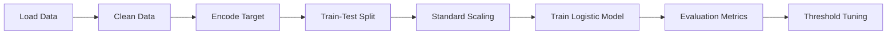

# 🧬 Breast Cancer Diagnosis Prediction
### 📊 Data Analysis • Machine Learning • Logistic Regression

---

## ✨ Project Overview

This project focuses on **predicting breast cancer diagnosis (Malignant or Benign)** using **Logistic Regression**.  
It demonstrates **end-to-end machine learning workflow**, from data cleaning to model evaluation and threshold tuning.

🎯 **Objective:**  
Accurately classify tumors as **Malignant (M)** or **Benign (B)** using medical diagnostic features.

---

## 📂 Dataset Description

📌 **Total Rows:** 569  
📌 **Total Features:** 30 numeric + target label  

### 🔑 Key Columns
| Column | Description |
|------|------------|
| `id` | Unique patient ID |
| `diagnosis` | Target variable (M = Malignant, B = Benign) |
| `radius_mean` | Mean radius of tumor |
| `texture_mean` | Mean texture |
| `perimeter_mean` | Mean perimeter |
| `area_mean` | Mean area |
| `smoothness_mean` | Tumor smoothness |
| `concavity_mean` | Tumor concavity |
| `symmetry_worst` | Worst symmetry |
| `fractal_dimension_worst` | Worst fractal dimension |

🧹 Dropped unnecessary column: `Unnamed: 32`

---

## 🧠 Concepts Covered

🟦 Data Cleaning  
🟩 Feature Scaling  
🟨 Logistic Regression  
🟥 Confusion Matrix  
🟪 ROC & AUC  
🟧 Threshold Optimization  

---

## ⚙️ Workflow

## 🧪 Machine Learning Model

Algorithm: Logistic Regression

Solver: liblinear

Scaling: StandardScaler

Train-Test Split: 70% / 30%

Stratified Sampling: Yes

## 📊 Model Performance (Threshold = 0.5)
Metric	Score
✅ Accuracy	97.08%
🎯 Precision	98.36%
🔁 Recall	93.75%
📈 ROC-AUC	99.75%

## 📉 Confusion Matrix
[[106   1]
 [  4  60]]

 ✔ Very low false positives
✔ Strong malignant detection capability

## 📈 ROC Curve

The ROC curve shows excellent class separation, confirming strong model reliability.

## 🎚️ Threshold Tuning Analysis

| Threshold | Precision | Recall     |
| --------- | --------- | ---------- |
| 0.9       | 1.0000    | 0.8281     |
| 0.7       | 1.0000    | 0.9219     |
| 0.5       | 0.9836    | 0.9375     |
| 0.3       | 0.9841    | **0.9688** |

## 🛠️ Technologies Used

Python
Pandas
NumPy
Matplotlib
Scikit-learn
Jupyter Notebook

